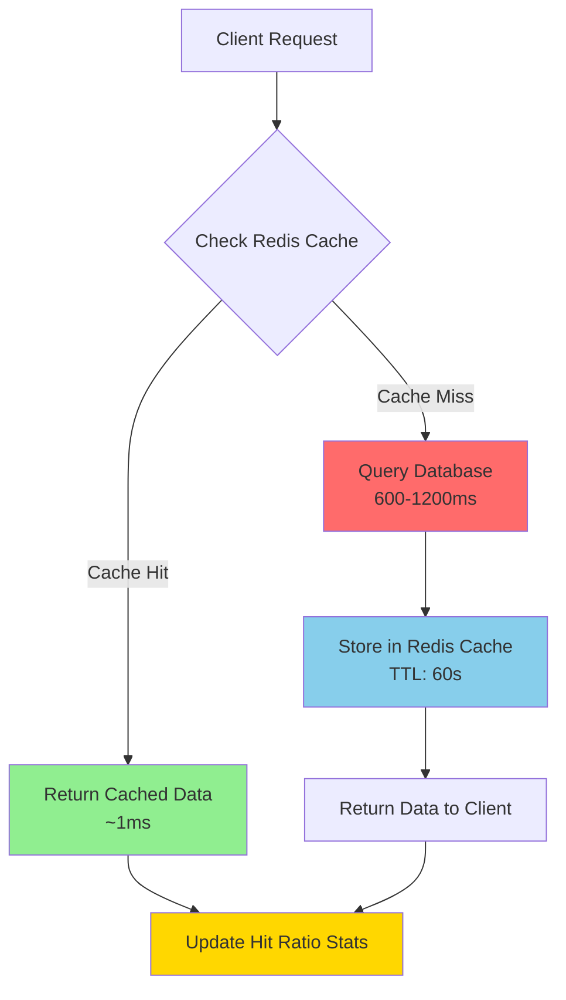
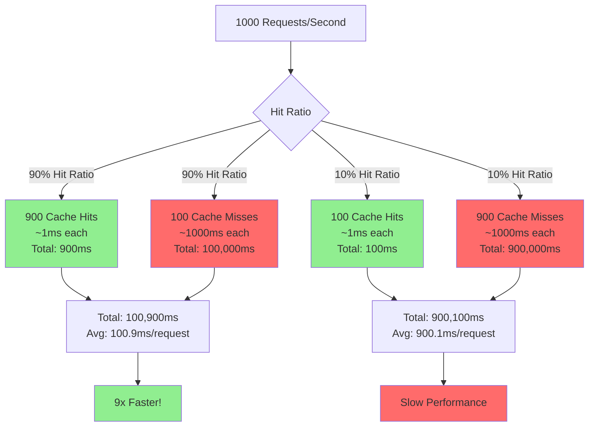

# Redis Cache Heatmap - Workshop Walkthrough Guide

## Table of Contents
1. [Introduction & Overview](#introduction--overview)
2. [3D Heatmap Visualization](#3d-heatmap-visualization)
3. [Top Bar & Statistics](#top-bar--statistics)
4. [Command Playground](#command-playground)
5. [Educational Popups](#educational-popups)
6. [Workshop Scenarios](#workshop-scenarios)
7. [Workshop Control Panel](#workshop-control-panel)
8. [Legend & Color Coding](#legend--color-coding)
9. [Mermaid Diagrams for Board Drawing](#mermaid-diagrams-for-board-drawing)

---

## Introduction & Overview

### Opening Statement
*"Welcome to the Redis Cache Heatmap workshop. Today we're going to visualize how Redis caching works in real-time using a 3D interactive demonstration. This tool shows you exactly what happens when data is cached versus when it's not - and you'll see the performance difference visually."*

### What You'll See
- **3D Wall of 400 Cubes**: Each cube represents a potential cache location
- **Real-time Updates**: Watch as cache hits and misses happen live
- **Performance Metrics**: See hit ratios and operations per second
- **Interactive Commands**: Execute Redis commands and see the results

### Key Concepts We'll Cover
1. **Cache-Aside Pattern**: How applications check cache before database
2. **Cache Hits vs Misses**: Fast vs slow data retrieval
3. **TTL (Time To Live)**: Automatic expiration of cached data
4. **Hit Ratio**: The percentage of requests served from cache
5. **Cache Warming**: Pre-loading frequently accessed data

---

## 3D Heatmap Visualization

### Section Overview
*"The centerpiece of our demo is this 3D wall. It's a 20x20 grid - 400 cubes total. Each cube can light up to show different types of Redis operations happening in real-time."*

### What to Show
1. **Point to the 3D wall** - *"This is our cache visualization"*
2. **Explain the grid** - *"400 cubes, each representing a potential cache location"*
3. **Wait for activity** - *"Watch as cubes light up - each flash represents a Redis operation"*

### Speaking Notes

**Initial Observation:**
*"Right now, you might see some gray cubes - those are idle. But watch what happens when we start making requests..."*

**When Cubes Light Up:**
*"See that cube flash? That's a Redis command being executed. The color tells you what type of operation it was:"*
- *"Green = GET command (reading data)"*
- *"Blue = SET command (writing data)"*
- *"Red = DEL command (deleting data)"*
- *"Yellow = INCR command (incrementing a number)"*
- *"Orange = EXPIRE command (setting expiration)"*

**Why This Matters:**
*"Redis does this because it needs to track every operation for performance monitoring. In production, you'd use Redis commands like MONITOR or SLOWLOG to see what's happening, but here we're visualizing it in real-time so you can understand the patterns."*

### Interactive Demo Steps

**Step 1: Show Idle State**
- *"Notice most cubes are gray - that's the idle state"*
- *"This represents a cache that hasn't been accessed yet"*

**Step 2: Trigger Activity**
- Click **"Warm Up"** button in Top Bar
- *"Watch what happens when we populate the cache..."*
- *"You'll see cubes lighting up in different colors"*

**Step 3: Explain the Mapping**
- *"Each key in Redis gets mapped to a specific cube using a hash function"*
- *"The same key always maps to the same cube - that's deterministic"*
- *"This is similar to how Redis uses hash tables internally to find keys quickly"*

**Step 4: Show Different Command Types**
- Open **Command Playground** (we'll cover this next)
- Execute: `SET user:123 "John Doe"`
- *"See that blue flash? That's a SET operation"*
- Execute: `GET user:123`
- *"Now green - that's a GET operation"*

---

## Top Bar & Statistics

### Section Overview
*"At the top of the screen, we have our control center. This shows you real-time statistics and gives you quick access to all the features."*

### What to Show

**1. Connection Status Badge**
- *"The 'Connected' badge shows we're talking to the Redis server"*
- *"If this turns red, we've lost connection"*

**2. Hit Ratio Badge**
- *"This is the most important metric - your cache hit ratio"*
- *"It shows what percentage of requests are being served from cache"*
- *"Green = good (80%+), Yellow = okay (50-80%), Red = poor (<50%)"*

**Speaking Notes:**
*"Redis tracks this because hit ratio directly correlates to performance. A high hit ratio means most requests are fast. A low hit ratio means you're hitting the database too often, which is slow and expensive."*

**3. Operations Per Second**
- *"This shows how many Redis commands we're executing per second"*
- *"This is your throughput - how much work Redis is doing"*

**Speaking Notes:**
*"Redis can handle hundreds of thousands of operations per second. Here we're showing a small sample, but in production, Redis is designed to handle massive scale."*

**4. Buttons in Top Bar**

**"Command" Button:**
- *"Opens the command playground where you can execute Redis commands directly"*
- *"We'll explore this in detail next"*

**"Learn" Button:**
- *"Opens educational popups explaining Redis concepts"*
- *"Great for understanding the theory behind what you're seeing"*

**"Scenarios" Button:**
- *"Pre-built workshop scenarios with step-by-step instructions"*
- *"Perfect for guided learning"*

**"Control" Button:**
- *"Advanced control panel for traffic generation and metrics"*
- *"We'll cover this later"*

**"Warm Up" Button:**
- *"This pre-populates the cache with 50 items"*
- *"Watch what happens to the hit ratio after warming..."*

### Interactive Demo Steps

**Step 1: Show Cold Cache**
- *"Notice the hit ratio is 0% - we haven't accessed anything yet"*
- *"This is a 'cold cache' - empty and ready to be populated"*

**Step 2: Click "Warm Up"**
- Click the **"Warm Up"** button
- *"Watch the operations per second spike"*
- *"See cubes lighting up across the wall"*
- *"This simulates pre-loading frequently accessed data"*

**Step 3: Observe Hit Ratio Improvement**
- Wait 10-15 seconds
- *"Now watch the hit ratio - it should be climbing"*
- *"As more requests come in, they find data in cache (hits) instead of going to database (misses)"*

**Step 4: Explain Why This Matters**
- *"In production, you'd warm your cache on startup or during low-traffic periods"*
- *"Redis does this efficiently because it's in-memory - much faster than disk-based databases"*

---

## Command Playground

### Section Overview
*"The Command Playground is where you can interact directly with Redis, just like you would in a production environment."*

### What to Show
1. **Open Command Playground** - Click **"Command"** button in Top Bar
2. **Show the interface** - Terminal-like interface with command input
3. **Show examples** - Pre-loaded command examples on the right

### Speaking Notes

**Introduction:**
*"This is like the Redis CLI - you can execute any Redis command here and see the results immediately. Redis uses a simple text-based protocol called RESP (Redis Serialization Protocol), but here we're using a more user-friendly interface."*

### Interactive Demo Steps

**Step 1: Basic GET/SET Operations**

**Show SET:**
- Type: `SET workshop:demo "Hello Redis"`
- Press Enter or click Send
- *"See that blue flash on the wall? That's the SET operation"*
- *"Redis stores this key-value pair in memory"*

**Speaking Notes:**
*"Redis does this because it's a key-value store - the simplest and fastest data structure. Keys are always strings, and values can be strings, numbers, lists, sets, or more complex structures."*

**Show GET:**
- Type: `GET workshop:demo`
- Press Enter
- *"Green flash - that's a GET operation"*
- *"Notice how fast it was? That's because the data is in memory"*

**Speaking Notes:**
*"Redis does this in microseconds because everything is in RAM. No disk I/O, no network calls to a database - just direct memory access. That's why Redis is so fast."*

**Step 2: Check if Key Exists**

- Type: `EXISTS workshop:demo`
- *"Returns 1 if the key exists, 0 if it doesn't"*
- *"This is useful for checking cache before expensive operations"*

**Step 3: Set with Expiration (TTL)**

- Type: `SET session:user123 "active" EX 30`
- *"This sets a key that expires in 30 seconds"*
- *"Watch the wall - you'll see an orange flash for the EXPIRE operation"*

**Speaking Notes:**
*"Redis does this automatically - it has a background process that checks for expired keys. This is crucial for preventing memory leaks and ensuring data freshness. In production, you'd use TTLs for session data, API tokens, or any temporary data."*

**Step 4: Delete a Key**

- Type: `DEL workshop:demo`
- *"Red flash - that's a DELETE operation"*
- *"The key is now removed from memory"*

**Step 5: Pattern Matching with KEYS**

- Type: `KEYS workshop:*`
- *"This finds all keys matching a pattern"*
- *"Useful for debugging or bulk operations"*

**Speaking Notes:**
*"Redis does this by scanning all keys - be careful in production! KEYS can block the server if you have millions of keys. In production, you'd use SCAN instead, which is non-blocking."*

**Step 6: Server Information**

- Type: `INFO`
- *"Shows detailed server statistics"*
- *"You can see memory usage, connected clients, hit ratio, and more"*

**Step 7: Database Size**

- Type: `DBSIZE`
- *"Returns the number of keys in the current database"*
- *"Useful for monitoring cache size"*

**Step 8: Clear Everything (Careful!)**

- Type: `FLUSHDB`
- *"This clears all keys - watch the hit ratio drop to 0%"*
- *"In production, you'd rarely do this - it's destructive!"*

### Advanced Commands

**Sorted Sets (Leaderboards):**
- Type: `ZADD leaderboard 100 alice 95 bob 87 charlie`
- *"Adds members to a sorted set with scores"*
- *"Perfect for leaderboards, rankings, or time-series data"*

- Type: `ZRANGE leaderboard 0 -1 WITHSCORES`
- *"Gets all members sorted by score"*
- *"Redis maintains this order automatically using a skip list data structure"*

**Speaking Notes:**
*"Redis does this efficiently using a combination of a hash table (for O(1) lookups) and a skip list (for sorted order). This is why Redis can handle complex data structures while maintaining high performance."*

---

## Educational Popups

### Section Overview
*"The Educational Popups provide context and theory behind what you're seeing. These are great for understanding the 'why' behind Redis."*

### What to Show
1. Click **"Learn"** button in Top Bar
2. Navigate through different topics
3. Read explanations while watching the visualization

### Speaking Notes

**When to Use:**
*"If you're wondering 'why does Redis do this?' or 'how does this work?', the educational popups have the answers. They explain the theory while you see it in practice."*

**Key Topics Covered:**
- Cache-Aside Pattern
- TTL and Expiration
- Memory Management
- Performance Optimization
- Data Structures

---

## Workshop Scenarios

### Section Overview
*"Workshop Scenarios are pre-built learning paths with step-by-step instructions. These guide you through specific Redis concepts."*

### What to Show
1. Click **"Scenarios"** button in Top Bar
2. Select a scenario (e.g., "Cold vs Warm Cache")
3. Follow the step-by-step instructions

### Scenario 1: Cold vs Warm Cache

**Step-by-Step Walkthrough:**

**Step 1: Clear the Cache**
- Click **"Scenarios"** → Select **"Cold vs Warm Cache"**
- Follow instruction: Execute `FLUSHDB`
- *"We're starting with an empty cache - this is a 'cold cache'"*

**Speaking Notes:**
*"A cold cache means no data is cached yet. Every request will be a miss, which means every request goes to the database. This is slow and expensive."*

**Step 2: Observe Cache Misses**
- *"Watch the wall - notice all the red flashes"*
- *"Each red flash is a cache miss - the data wasn't in cache, so it had to go to the database"*
- *"Notice how slow this is? Each miss takes 600-1200ms because we're simulating a database query"*

**Speaking Notes:**
*"Redis does this because it implements the cache-aside pattern. When data isn't in cache, the application fetches it from the database, then stores it in Redis for next time. This is the most common caching pattern."*

**Step 3: Check Hit Ratio**
- Execute: `INFO`
- *"See the hit ratio? It's 0% or very low"*
- *"This means every request is going to the database"*

**Step 4: Warm Up the Cache**
- Click **"Warm Up"** button in Top Bar
- *"This pre-populates the cache with 50 frequently accessed items"*
- *"Watch the cubes light up - these are cache writes (SET operations)"*

**Speaking Notes:**
*"Redis does this efficiently because writes are fast - just storing data in memory. In production, you'd warm your cache on application startup or during scheduled maintenance windows."*

**Step 5: Observe Cache Hits**
- Wait 10-15 seconds
- *"Now watch the wall - you should see green flashes"*
- *"Green means cache hit - the data was found in Redis"*
- *"Notice how fast these are? Less than 10ms compared to 600-1200ms for misses"*

**Step 6: Check Hit Ratio Again**
- Execute: `INFO` again
- *"The hit ratio should now be 80% or higher"*
- *"This means 80% of requests are being served from cache - fast and efficient!"*

**Speaking Notes:**
*"Redis tracks hit ratio because it's the most important performance metric. A high hit ratio means your cache is working well. A low hit ratio means you need to adjust your caching strategy - maybe cache more data, or cache it for longer."*

### Scenario 2: TTL and Expiration

**Step-by-Step Walkthrough:**

**Step 1: Set Keys with Different TTLs**
- Select **"TTL and Expiration"** scenario
- Execute: `SET temp:data1 "value1" EX 10`
- Execute: `SET temp:data2 "value2" EX 30`
- Execute: `SET temp:data3 "value3" EX 60`
- *"We've set three keys with different expiration times"*

**Speaking Notes:**
*"Redis does this using a background process that checks for expired keys. It uses a heap data structure to efficiently find keys that need to expire. This prevents memory leaks and ensures data freshness."*

**Step 2: Check TTL**
- Execute: `TTL temp:data1`
- *"Returns seconds until expiration, or -2 if key doesn't exist, -1 if no expiration"*
- *"This is useful for debugging cache behavior"*

**Step 3: Wait and Observe**
- Wait 15 seconds
- Execute: `GET temp:data1`
- *"Returns null - the key expired!"*
- *"Redis automatically removed it from memory"*

**Step 4: Check Remaining Keys**
- Execute: `KEYS temp:*`
- *"Only data2 and data3 remain - data1 expired"*

**Speaking Notes:**
*"Redis does this automatically in the background. You don't have to manually clean up expired keys - Redis handles it for you. This is one of the reasons Redis is so popular for session management and temporary data."*

---

## Workshop Control Panel

### Section Overview
*"The Control Panel is your advanced control center. Here you can generate traffic, monitor metrics, and control the demo environment."*

### What to Show
1. Click **"Control"** button in Top Bar
2. Show different sections of the control panel
3. Demonstrate traffic generation

### Speaking Notes

**Introduction:**
*"This is where we can simulate real-world traffic patterns. In production, you'd use tools like Redis monitoring or APM (Application Performance Monitoring) to see this data, but here we can control it for demonstration purposes."*

### Interactive Demo Steps

**Step 1: Traffic Generation**

**Show Traffic Controls:**
- *"Here we can control how much traffic we generate"*
- *"Rate: How many requests per second"*
- *"Pattern: Uniform (steady), Burst (spikes), or Zipf (realistic distribution)"*

**Speaking Notes:**
*"Redis does this in production - it handles traffic patterns automatically. But understanding these patterns helps you design better caching strategies. Zipf distribution is realistic - a few popular items get most of the traffic (80/20 rule)."*

**Start Traffic:**
- Set rate to 10 requests/second
- Click Play
- *"Watch the wall light up - this simulates real application traffic"*
- *"Notice how the hit ratio changes over time"*

**Step 2: Metrics Monitoring**

**Show Metrics Section:**
- *"This shows historical metrics"*
- *"Hit ratio over time, operations per second, cache size"*
- *"In production, you'd graph this in tools like Grafana or Datadog"*

**Speaking Notes:**
*"Redis provides these metrics through the INFO command or monitoring tools. Tracking metrics over time helps you understand cache performance and identify issues before they become problems."*

**Step 3: Quick Actions**

**Populate Test Data:**
- Click **"Populate Test Data"**
- *"This creates a realistic dataset for testing"*
- *"Useful for demonstrating cache behavior with real-world data patterns"*

**Clear Cache:**
- Click **"Clear Cache"**
- *"Empties the cache - watch the hit ratio drop"*
- *"In production, you'd rarely do this - maybe during maintenance"*

**Reset Statistics:**
- Click **"Reset Statistics"**
- *"Clears the hit/miss counters"*
- *"Useful for starting a fresh demo"*

**Step 4: State Management**

**Save State:**
- Click **"Save State"**
- *"Saves the current cache state"*
- *"Useful for creating reproducible demos"*

**Load State:**
- Click **"Load State"**
- *"Restores a previously saved state"*
- *"Great for showing specific scenarios"*

---

## Legend & Color Coding

### Section Overview
*"The Legend in the bottom-left corner shows you what each color means. This is your key to understanding the visualization."*

### What to Show
1. Point to the Legend panel
2. Explain each color and animation pattern
3. Show how it relates to Redis commands

### Speaking Notes

**Color Meanings:**
- **Green (GET)**: *"Reading data from cache - this is what you want most of the time"*
- **Blue (SET)**: *"Writing data to cache - happens when you store new data or update existing data"*
- **Red (DEL)**: *"Deleting data - removing keys from cache"*
- **Yellow (INCR)**: *"Incrementing a number - useful for counters, votes, views"*
- **Orange (EXPIRE)**: *"Setting expiration time - telling Redis when to delete a key"*
- **Light Blue (OTHER)**: *"Other Redis commands - there are over 200 commands in Redis!"*

**Animation Patterns:**
- **Smooth Pulse (GET)**: *"Gentle animation for read operations"*
- **Bouncy (SET)**: *"More energetic for write operations"*
- **Sharp Spike (DEL)**: *"Quick, sharp animation for deletions"*
- **Wave (INCR)**: *"Wavy motion for increment operations"*
- **Fade (EXPIRE)**: *"Fading animation suggesting time passing"*

**Hit Ratio Display:**
- *"The legend also shows live hit ratio"*
- *"This updates in real-time as requests come in"*
- *"Total requests shows how many operations have been executed"*

**Speaking Notes:**
*"Redis tracks all of this internally. The colors and animations are just our way of visualizing what Redis is doing. In production, you'd use Redis commands like MONITOR, SLOWLOG, or INFO to see this data."*

---

## Mermaid Diagrams for Board Drawing

### Diagram 1: Cache-Aside Pattern Flow



**What to Draw:**
1. Start with "Client Request" at the top
2. Draw a decision diamond: "Check Redis Cache?"
3. Two paths:
   - **Hit Path (Green)**: Fast return (~1ms)
   - **Miss Path (Red)**: Slow database query (600-1200ms)
4. From miss path: Store in Redis, then return
5. Both paths update hit ratio stats

**Speaking Notes:**
*"This is the cache-aside pattern - the most common caching strategy. The application checks Redis first. If data is there (hit), return it fast. If not (miss), go to the database, store it in Redis for next time, then return it. Redis does this because it's designed to be a fast, in-memory cache layer in front of slower persistent storage."*

---

### Diagram 2: Redis Architecture & Data Flow

```mermaid
graph LR
    subgraph "Application Layer"
        A[Web App]
        B[API Server]
    end
    
    subgraph "Cache Layer"
        C[Redis Server<br/>In-Memory Store]
        D[Hash Tables<br/>O(1) Lookups]
        E[TTL Manager<br/>Expiration]
    end
    
    subgraph "Storage Layer"
        F[Database<br/>PostgreSQL/MySQL]
        G[Disk Storage]
    end
    
    A -->|HTTP Requests| B
    B -->|Check Cache| C
    C -->|Fast Lookup| D
    C -->|Expiration Check| E
    C -->|Cache Miss| F
    F -->|Read/Write| G
    F -->|Store in Cache| C
    
    style C fill:#FF6B6B
    style D fill:#90EE90
    style E fill:#FFA500
    style F fill:#87CEEB
```

**What to Draw:**
1. Three layers: Application, Cache, Storage
2. Application makes requests to API Server
3. API Server checks Redis (Cache Layer)
4. Redis uses Hash Tables for fast lookups
5. TTL Manager handles expiration
6. On cache miss, go to Database
7. Database stores in Redis for next time

**Speaking Notes:**
*"This shows the full architecture. Redis sits between your application and database. It uses hash tables internally for O(1) key lookups - that's why it's so fast. The TTL manager automatically expires old data. When there's a cache miss, the request goes to the database, which is slower but persistent. Redis does this because it's optimized for speed - everything in memory, optimized data structures, and efficient algorithms."*

---

### Diagram 3: Hit Ratio Impact on Performance



**What to Draw:**
1. Start with "1000 Requests/Second"
2. Split into two scenarios: 90% hit ratio vs 10% hit ratio
3. For each scenario, show:
   - Number of hits (fast) vs misses (slow)
   - Total time for each type
   - Average response time
4. Compare results: 9x faster with high hit ratio

**Speaking Notes:**
*"This diagram shows why hit ratio matters so much. With 90% hit ratio, most requests are fast (cache hits). With 10% hit ratio, most requests are slow (cache misses). The difference is dramatic - 9x faster! Redis tracks hit ratio because it's the single most important metric for cache performance. In production, you'd aim for 80%+ hit ratio. If it's lower, you need to adjust your caching strategy."*

---

## Closing Notes

### Key Takeaways
1. **Cache-Aside Pattern**: Check cache first, fall back to database
2. **Hit Ratio is Critical**: Higher hit ratio = better performance
3. **TTL Prevents Stale Data**: Automatic expiration keeps data fresh
4. **Redis is Fast**: In-memory storage = microsecond response times
5. **Visualization Helps**: Seeing cache behavior makes concepts concrete

### Questions to Address
- *"Why is Redis so fast?"* - Everything in memory, optimized data structures
- *"What's a good hit ratio?"* - 80%+ is excellent, below 50% needs improvement
- *"When should I use Redis?"* - Session storage, caching, real-time data, leaderboards
- *"How does Redis handle expiration?"* - Background process checks TTLs automatically
- *"What happens if Redis goes down?"* - Cache misses increase, but app still works (falls back to database)

### Next Steps
- Try different scenarios in the Workshop Scenarios panel
- Experiment with different TTL values
- Generate traffic and watch hit ratio change
- Execute commands in the Command Playground
- Explore the Educational Popups for deeper understanding

---

## Quick Reference: Common Speaking Points

### When Showing Cache Hits (Green):
*"This is a cache hit - the data was found in Redis. Notice how fast this is? Less than 10 milliseconds. Redis does this because it stores everything in memory, so there's no disk I/O, no network latency to a database - just direct memory access."*

### When Showing Cache Misses (Red):
*"This is a cache miss - the data wasn't in Redis, so it had to go to the database. Notice how slow this is? 600-1200 milliseconds. This is why we cache - to avoid these slow database queries. Redis does this by implementing the cache-aside pattern - check cache first, then database if needed."*

### When Showing Hit Ratio:
*"The hit ratio shows what percentage of requests are served from cache. Higher is better. Redis tracks this because it's the most important performance metric. In production, you'd monitor this in real-time and alert if it drops below a threshold."*

### When Showing TTL/Expiration:
*"Redis automatically expires keys based on their TTL. This prevents memory leaks and ensures data freshness. Redis does this using a background process that efficiently finds and removes expired keys using a heap data structure."*

### When Showing Different Command Types:
*"Redis has over 200 commands, but these are the most common. Each command has a specific purpose and performance characteristics. Redis does this because it's designed to be a general-purpose data structure server - not just a cache, but a full-featured database."*

---

*End of Workshop Walkthrough Guide*

